# :star2: 프로젝트 개요

## :busts_in_silhouette: 팀원 소개
| | | | |  | |
| :------------------------------------: | :-------------------------------------: | :-----------------------------------: | :--------------------------------------: | :-----------------------------------: | :------------------------------------------: |
| [기우석](https://github.com/woosuk1) | [김동혁](https://github.com/dongkh9) | [백경석](https://github.com/Hellin22) | [유혜진](https://github.com/yuhyejin) | [이서현](https://github.com/sh694090) | [이우진](https://github.com/Vorschlag-bit) |

## 기술 스택

## :one: 프로젝트 소개
<figure>
  
</figure>

- '캐스트 온'은 뜨개질에서 작품을 시작할 때 처음 코잡기를 한다는 의미입니다.
- 이러한 의미처럼 기존에 뜨개질을 취미로 가지고 있는 사람뿐만 아니라, 처음 입문하는 사람들도 쉽게 접근할 수 있는 서비스를 목적으로 하고 있습니다.
- '캐스트 온'에서는 여러 플랫폼에 분산되어 있는 뜨개 관련 정보를 한 곳에서 보고, 함께 소통할 수 있습니다.

## :two: 서비스 도입 배경

<figure>
  <a href="link"></a> 
  <a href="link"></a>
</figure>

- 왼쪽 그래프는 온라인 상에서 2021년 1월부터 2023년 12월 사이의 뜨개질 언급량 추이를 기록한 그래프입니다. 2021년보다 2023년에서 ‘뜨개’라는 단어의 언급량이 2.8배 증가했음을 볼 수 있습니다.
- 오른쪽 기사는 24년 1월 2일 발행된 기사로 우리나라 뜨개 기업인 ‘바늘 이야기’의 20, 30대 매출액 비중이 절반을 넘겼음을 확인할 수 있습니다. 현재 유튜브, 인스타그램 등 다양한 플랫폼에서 많은 사람들이 뜨개 관련 정보를 공유하며 커뮤니티를 형성하고 있습니다.

## :three: 유사 서비스

### :round_pushpin: Ravelry (래블리)

<figure>
  
  
</figure>

- **Ravelry**는 미국의 뜨개 커뮤니티로, 전 세계의 도안 디자이너들이 활동하고 있습니다. </p>
- **장점**: 전 세계의 뜨개인들이 활동하고 있기 때문에 다양한 도안을 접할 수 있습니다. </br>
- **단점**: 영어로 된 뜨개 용어를 사용하기 때문에 초심자의 진입장벽이 높습니다.


### :round_pushpin: 도아니티
<figure class="half">
  <a href="link"></a> 
  <a href="link"></a>  
</figure>

- **도아니티**는 국내 뜨개 기업인 ‘바늘 이야기’에서 만든 커뮤니티입니다. </p>
- **장점**: 국내에서 만든 커뮤니티이기 때문에 초심자도 쉽게 접근할 수 있습니다. </br>
- **단점**: 도안 판매 위주로 운영되어 커뮤니티의 역할은 크지 않습니다.

## :four: 차별화 전략

- 우리나라의 다양한 뜨개 디자이너들이 **한국어로 활동**할 수 있습니다. </p>
- 도안 게시자가 난이도를 지정하고, 실제 이용자들이 평가해 **정확한 도안 난이도를 제공**합니다. </p>
- 게시글 및 댓글 작성 수를 기준으로 회원별 등급을 지정해 **커뮤니티를 활성화**합니다. </p>
- 판매보다는 **나눔과 공유**를 지향합니다. </p>
- **한국어 용어**를 사용해 뜨개 입문자들도 뜨개질에 쉽게 접근할 수 있습니다. </p>

# :star2: 요구사항 명세서

# :star2: DB 모델링

## :one: 개념 모델링
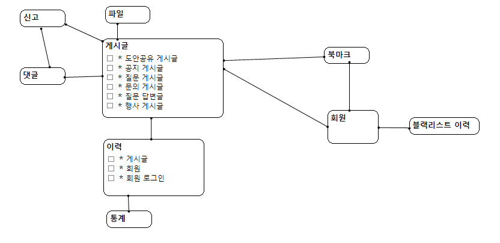
### 고려 사항

## :two: 논리 모델링
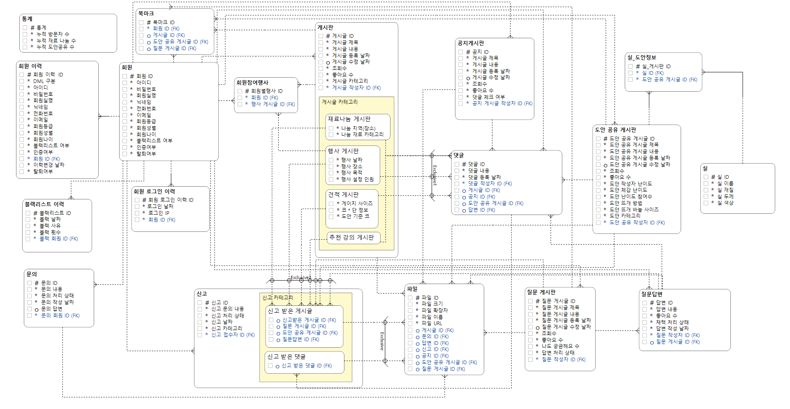
### 고려 사항

## :three: 물리 모델링
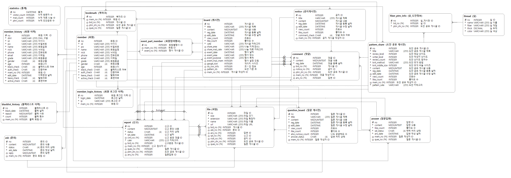
### 고려 사항

# :star2: DDL

<details>
<summary>DDL 코드</summary>
<div markdown = '1'>
  
```
DROP DATABASE if EXISTS caston;
CREATE DATABASE caston;

USE caston;

DROP TABLE IF EXISTS blacklist_history;
DROP TABLE IF EXISTS bookmark;
DROP TABLE IF EXISTS fiber_ptrn_info;
DROP TABLE IF EXISTS statistics;
DROP TABLE IF EXISTS file;
DROP TABLE IF EXISTS member_login_history;
DROP TABLE IF EXISTS member_history;
DROP TABLE IF EXISTS event_part_member;
DROP TABLE IF EXISTS ask;
DROP TABLE IF EXISTS report;
DROP TABLE IF EXISTS thread;
DROP TABLE IF EXISTS answer;
DROP TABLE IF EXISTS question_board;
DROP TABLE if EXISTS comment;
DROP TABLE IF EXISTS notice;
DROP TABLE IF EXISTS pattern_share;
DROP TABLE IF EXISTS board;
DROP TABLE IF EXISTS member;
DROP TABLE if EXISTS member_login_per_hour;
SHOW TABLES;

CREATE TABLE IF NOT EXISTS thread
(
    no INTEGER NOT NULL AUTO_INCREMENT comment '실 ID',
    name VARCHAR(255) NOT NULL comment '실 이름',
    fiber VARCHAR(255) NOT NULL comment '실 재질',
    thick DECIMAL NOT NULL comment '실 두께',
    color VARCHAR(255) NOT NULL comment '실 색상',
    PRIMARY KEY (no)
)
comment = '실';


-- Create tables with proper foreign key constraints
CREATE TABLE IF NOT EXISTS member
(
    no INTEGER NOT NULL AUTO_INCREMENT COMMENT '회원 ID',
    id VARCHAR(255) NOT NULL COMMENT '아이디',
    pw VARCHAR(255) NOT NULL COMMENT '비밀번호',
    name VARCHAR(255) NOT NULL COMMENT '회원실명',
    nick VARCHAR(255) NOT NULL COMMENT '닉네임',
    phone VARCHAR(255) NOT NULL COMMENT '전화번호',
    email VARCHAR(255) NOT NULL COMMENT '이메일',
    grade VARCHAR(255) NOT NULL COMMENT '회원등급',
    gender CHAR(4) NOT NULL CHECK(gender IN ('M', 'F')),
    age INTEGER NOT NULL COMMENT '회원나이',
    leave_check CHAR(4) DEFAULT 'N' NOT NULL CHECK(leave_check IN ('Y', 'N')),
    black_check CHAR(4) DEFAULT 'N' NOT NULL CHECK(black_check IN ('Y', 'N')),
    auth_check CHAR(4) DEFAULT 'N' NOT NULL CHECK(auth_check IN ('Y', 'N')),
    PRIMARY KEY (no)
)
COMMENT = '회원';       

CREATE TABLE IF NOT EXISTS question_board
(
    no INTEGER NOT NULL AUTO_INCREMENT COMMENT '질문 게시글 ID',
    title VARCHAR(255) NOT NULL COMMENT '질문 제목',
    content MEDIUMTEXT NOT NULL COMMENT '질문 내용',
    reg_date DATETIME NOT NULL COMMENT '등록 날짜',
    edit_date DATETIME COMMENT '수정 날짜',
    view_count INTEGER DEFAULT 0 NOT NULL COMMENT '조회수',
    like_count INTEGER DEFAULT 0 NOT NULL COMMENT '좋아요 수',
    also_curious_count INTEGER DEFAULT 0 NOT NULL COMMENT '나도 궁금해요 수',
    answer_status CHAR(4) DEFAULT 'N' NOT NULL CHECK(answer_status IN ('Y', 'N')),
    mem_no INTEGER NOT NULL COMMENT '질문 작성자 ID',
    PRIMARY KEY (no),
    FOREIGN KEY (mem_no) REFERENCES member(no)
)
COMMENT = '질문게시판';

CREATE TABLE IF NOT EXISTS answer
(
    no INTEGER NOT NULL AUTO_INCREMENT COMMENT '답변 ID',
    content MEDIUMTEXT NOT NULL COMMENT '답변 내용',
    like_count INTEGER DEFAULT 0 NOT NULL COMMENT '좋아요 수',
    sel_status CHAR(4) DEFAULT 'N' NOT NULL CHECK(sel_status IN ('Y', 'N')),
    ans_date DATETIME NOT NULL COMMENT '답변 작성 날짜',
    mem_no INTEGER NOT NULL COMMENT '답변 작성자 ID',
    ques_no INTEGER NOT NULL COMMENT '질문 게시글 ID',
    PRIMARY KEY (no),
    FOREIGN KEY (mem_no) REFERENCES member(no),
    FOREIGN KEY (ques_no) REFERENCES question_board(no) ON DELETE CASCADE
)
COMMENT = '질문답변';

CREATE TABLE IF NOT EXISTS ask
(
    no INTEGER NOT NULL AUTO_INCREMENT COMMENT '문의 ID',
    content MEDIUMTEXT NOT NULL COMMENT '문의 내용',
    status CHAR(4) DEFAULT 'N' NOT NULL CHECK(status IN ('Y', 'N')),
    ask_date DATETIME NOT NULL COMMENT '문의 작성 날짜',
    reply MEDIUMTEXT COMMENT '문의 답변',
    mem_no INTEGER NOT NULL COMMENT '문의 회원 ID',
    PRIMARY KEY (no),
    FOREIGN KEY (mem_no) REFERENCES member(no)
)
COMMENT = '문의';

CREATE TABLE IF NOT EXISTS blacklist_history
(
    no INTEGER NOT NULL AUTO_INCREMENT COMMENT '블랙리스트 ID',
    black_date DATETIME NOT NULL COMMENT '블랙 날짜',
    reason MEDIUMTEXT NOT NULL COMMENT '블랙 사유',
    count INTEGER DEFAULT 0 NOT NULL COMMENT '블랙 횟수',
    mem_no INTEGER NOT NULL COMMENT '블랙 회원 ID',
    PRIMARY KEY (no),
    FOREIGN KEY (mem_no) REFERENCES member(no)
)
COMMENT = '블랙리스트 이력';

CREATE TABLE IF NOT EXISTS board
(
    no INTEGER NOT NULL AUTO_INCREMENT COMMENT '게시글 ID',
    title VARCHAR(255) NOT NULL COMMENT '게시글 제목',
    content MEDIUMTEXT NOT NULL COMMENT '게시글 내용',
    reg_date DATETIME NOT NULL COMMENT '게시글 등록 날짜',
    edit_date DATETIME COMMENT '게시글 수정 날짜',
    view_count INTEGER DEFAULT 0 NOT NULL COMMENT '조회수',
    like_count INTEGER DEFAULT 0 NOT NULL COMMENT '좋아요 수',
    cate VARCHAR(255) NOT NULL COMMENT '게시글 카테고리',
    share_area VARCHAR(255) COMMENT '나눔 지역(장소)',
    share_mat_cate VARCHAR(255) COMMENT '나눔 재료 카테고리',
    event_date DATETIME COMMENT '행사 날짜',
    event_area VARCHAR(255) COMMENT '행사 장소',
    event_purpose VARCHAR(255) COMMENT '행사 목적',
    event_max_mem INTEGER COMMENT '행사 설정 인원',
    gauge_size INTEGER COMMENT '게이지 사이즈',
    sts_row_info INTEGER COMMENT '코 * 단 정보',
    pattern_sts INTEGER COMMENT '도안 기준 코',
    mem_no INTEGER NOT NULL COMMENT '게시글 작성자 ID',
    PRIMARY KEY (no),
    FOREIGN KEY (mem_no) REFERENCES member(no)
)
COMMENT = '게시글';


CREATE TABLE IF NOT EXISTS event_part_member
(
    no INTEGER NOT NULL AUTO_INCREMENT COMMENT '회원별행사 ID',
    mem_no INTEGER NOT NULL COMMENT '회원 ID',
    brd_no INTEGER NOT NULL COMMENT '행사 게시글 ID',
    PRIMARY KEY (no),
    FOREIGN KEY (mem_no) REFERENCES member(no),
    FOREIGN KEY (brd_no) REFERENCES board(no) ON DELETE CASCADE
)
COMMENT = '회원참여행사';

CREATE TABLE IF NOT EXISTS pattern_share
(
    no INTEGER NOT NULL AUTO_INCREMENT COMMENT '도안 공유 게시글 ID',
    title VARCHAR(255) NOT NULL COMMENT '도안 공유 게시글 제목',
    review_level VARCHAR(255) DEFAULT 0 NOT NULL COMMENT '도안 체감 난이도',
    writer_level VARCHAR(255)  NOT NULL COMMENT '도안 작성자 난이도',
    review_count INTEGER DEFAULT 0 NOT NULL COMMENT '도안 난이도 참여수',
    knit_method VARCHAR(255) NOT NULL COMMENT '도안 뜨개 방법',
    knit_niddle_size INTEGER NOT NULL COMMENT '도안 뜨개 바늘 사이즈',
    content MEDIUMTEXT NOT NULL COMMENT '도안 공유 게시글 내용',
    reg_date DATETIME NOT NULL COMMENT '도안 공유 게시글 등록 날짜',
    edit_date DATETIME COMMENT '도안 공유 게시글 수정 날짜',
    view_count INTEGER DEFAULT 0 NOT NULL COMMENT '조회수',
    like_count INTEGER DEFAULT 0 NOT NULL COMMENT '좋아요 수',
    mem_no INTEGER NOT NULL COMMENT '도안 공유 작성자 ID',
    pattern_cate VARCHAR(255) NOT NULL COMMENT '도안 카테고리',
    PRIMARY KEY (no),
    FOREIGN KEY (mem_no) REFERENCES member(no)
)
COMMENT = '도안 공유 게시판';       
 


CREATE TABLE IF NOT EXISTS fiber_ptrn_info
(
    no INTEGER NOT NULL AUTO_INCREMENT COMMENT '실_게시판 ID',
    trd_no INTEGER NOT NULL COMMENT '실 ID',
    ptrn_shr_no INTEGER NOT NULL COMMENT '도안 공유 게시글 ID',
    PRIMARY KEY (no),
    FOREIGN KEY (trd_no) REFERENCES thread(no) ON DELETE CASCADE,
    FOREIGN KEY (ptrn_shr_no) REFERENCES pattern_share(no) ON DELETE CASCADE
)
COMMENT = '실_도안정보';


CREATE TABLE IF NOT EXISTS member_history
(
    no INTEGER NOT NULL AUTO_INCREMENT COMMENT '회원 이력 ID',
    dml VARCHAR(255) NOT NULL COMMENT 'DML 구분',
    id VARCHAR(255) NOT NULL COMMENT '아이디',
    pw VARCHAR(255) NOT NULL COMMENT '비밀번호',
    name VARCHAR(255) NOT NULL COMMENT '회원실명',
    nick VARCHAR(255) NOT NULL COMMENT '닉네임',
    phone VARCHAR(255) NOT NULL COMMENT '전화번호',
    email VARCHAR(255) NOT NULL COMMENT '이메일',
    grade VARCHAR(255) NOT NULL COMMENT '회원등급',
    gender CHAR(4) NOT NULL CHECK(gender IN ('M', 'F')),
    age INTEGER NOT NULL COMMENT '회원나이',
    leave_check CHAR(4) DEFAULT 'N' NOT NULL CHECK(leave_check IN ('Y', 'N')),
    black_check CHAR(4) DEFAULT 'N' NOT NULL CHECK(black_check IN ('Y', 'N')),
    auth_check CHAR(4) DEFAULT 'N' NOT NULL CHECK(auth_check IN ('Y', 'N')),
    mem_no INTEGER NOT NULL COMMENT '회원 ID',
    edit_date DATETIME NOT NULL COMMENT '이력변경 날짜',
    PRIMARY KEY (no),
    FOREIGN KEY (mem_no) REFERENCES member(no)
)
COMMENT = '회원 이력';

CREATE TABLE IF NOT EXISTS member_login_history
(
    no INTEGER NOT NULL AUTO_INCREMENT COMMENT '회원 로그인 이력 ID',
    login_date DATETIME NOT NULL COMMENT '로그인 날짜',
    ip VARCHAR(255) NOT NULL COMMENT '로그인 IP',
    mem_no INTEGER NOT NULL COMMENT '회원 ID',
    PRIMARY KEY (no),
    FOREIGN KEY (mem_no) REFERENCES member(no)
)
COMMENT = '회원 로그인 이력';

CREATE TABLE IF NOT EXISTS notice
(
    no INTEGER NOT NULL AUTO_INCREMENT COMMENT '공지 ID',
    title VARCHAR(255) NOT NULL COMMENT '게시글 제목',
    content MEDIUMTEXT NOT NULL COMMENT '게시글 내용',
    reg_date DATETIME NOT NULL COMMENT '게시글 등록 날짜',
    edit_date DATETIME COMMENT '게시글 수정 날짜',
    view_count INTEGER DEFAULT 0 NOT NULL COMMENT '조회수',
    like_count INTEGER DEFAULT 0 NOT NULL COMMENT '좋아요 수',
    comment_check CHAR(4) DEFAULT 'N' NOT NULL CHECK(comment_check IN ('Y', 'N')),
    mem_no INTEGER NOT NULL COMMENT '공지 게시글 작성자 ID',
    PRIMARY KEY (no),
    FOREIGN KEY (mem_no) REFERENCES member(no)
)
COMMENT = '공지게시판';


CREATE TABLE IF NOT EXISTS comment
(
    no INTEGER NOT NULL AUTO_INCREMENT COMMENT '댓글 ID',
    content MEDIUMTEXT NOT NULL COMMENT '댓글 내용',
    reg_date DATETIME NOT NULL COMMENT '댓글 등록 날짜',
    brd_no INTEGER COMMENT '게시글 ID',
    notice_no INTEGER COMMENT '공지 ID',
    ptrn_shr_no INTEGER COMMENT '도안 공유 게시글 ID',
    mem_no INTEGER NOT NULL COMMENT '댓글 작성자 ID',
    PRIMARY KEY (no),
    FOREIGN KEY (brd_no) REFERENCES board(no) ON DELETE CASCADE,
    FOREIGN KEY (notice_no) REFERENCES notice(no) ON DELETE CASCADE,
    FOREIGN KEY (ptrn_shr_no) REFERENCES pattern_share(no) ON DELETE CASCADE,
    FOREIGN KEY (mem_no) REFERENCES member(no)
)
COMMENT = '댓글';

CREATE TABLE IF NOT EXISTS report
(
    no INTEGER NOT NULL AUTO_INCREMENT COMMENT '신고 ID',
    content MEDIUMTEXT NOT NULL COMMENT '신고 문의 내용',
    status CHAR(4) DEFAULT 'N' NOT NULL CHECK(status IN ('Y', 'N')),
    rpt_date DATETIME NOT NULL COMMENT '신고 날짜',
    cmt_no INTEGER COMMENT '신고 받은 댓글 ID',
    cate VARCHAR(255) NOT NULL COMMENT '신고 카테고리',
    brd_no INTEGER COMMENT '신고받은 게시글 ID',
    mem_no INTEGER NOT NULL COMMENT '신고 접수자 ID',
    ques_no INTEGER COMMENT '질문 게시글 ID',
    ptrn_shr_no INTEGER COMMENT '도안 공유 게시글 ID',
    ans_no INTEGER COMMENT '질문답변 ID',
    PRIMARY KEY (no),
    FOREIGN KEY (brd_no) REFERENCES board(no) ON DELETE CASCADE,
    FOREIGN KEY (mem_no) REFERENCES member(no),
    FOREIGN KEY (ques_no) REFERENCES question_board(no) ON DELETE CASCADE,
    FOREIGN KEY (ptrn_shr_no) REFERENCES pattern_share(no) ON DELETE CASCADE,
    FOREIGN KEY (ans_no) REFERENCES answer(no) ON DELETE CASCADE
)
COMMENT = '신고';

CREATE TABLE IF NOT EXISTS statistics
(
    no DATETIME NOT NULL COMMENT '통계',
    visitor_count INTEGER DEFAULT 0 NOT NULL COMMENT '누적 방문자 수',
    mat_count INTEGER DEFAULT 0 NOT NULL COMMENT '누적 재료 나눔 수',
    ptrn_count INTEGER DEFAULT 0 NOT NULL COMMENT '누적 도안공유 수',
    PRIMARY KEY (no)
)
COMMENT = '통계';


CREATE TABLE IF NOT EXISTS bookmark
(
    no INTEGER NOT NULL AUTO_INCREMENT COMMENT '북마크 ID',
    mem_no INTEGER NOT NULL COMMENT '회원 ID',
    brd_no INTEGER COMMENT '게시글 ID',
    ptrn_shr_no INTEGER COMMENT '도안 공유 게시글 ID',
    ques_no INTEGER COMMENT '질문 게시글 ID',
    PRIMARY KEY (no),
    FOREIGN KEY (mem_no) REFERENCES member(no),
    FOREIGN KEY (brd_no) REFERENCES board(no) ON DELETE CASCADE,
    FOREIGN KEY (ptrn_shr_no) REFERENCES pattern_share(no) ON DELETE CASCADE,
    FOREIGN KEY (ques_no) REFERENCES question_board(no) ON DELETE CASCADE
)
comment = '북마크';


CREATE TABLE IF NOT EXISTS file
(
    no INTEGER NOT NULL AUTO_INCREMENT COMMENT '파일 ID',
    size VARCHAR(255) NOT NULL COMMENT '파일 크기',
    extension VARCHAR(255) NOT NULL COMMENT '파일 확장자',
    name VARCHAR(255) NOT NULL COMMENT '파일 이름',
    url VARCHAR(255) NOT NULL COMMENT '파일 URL',
    brd_no INTEGER COMMENT '게시글 ID',
    ask_no INTEGER COMMENT '문의 ID',
    ans_no INTEGER COMMENT '답변 ID',
    rpt_no INTEGER COMMENT '신고 ID',
    noti_no INTEGER COMMENT '공지 ID',
    ptrn_shr_no INTEGER COMMENT '도안 공유 게시글 ID',
    ques_no INTEGER COMMENT '질문 게시글 ID',
    PRIMARY KEY (no),
    FOREIGN KEY (brd_no) REFERENCES board(no) ON DELETE CASCADE,
    FOREIGN KEY (ask_no) REFERENCES ask(no) ON DELETE CASCADE,
    FOREIGN KEY (ans_no) REFERENCES answer(no) ON DELETE CASCADE,
    FOREIGN KEY (rpt_no) REFERENCES report(no),
    FOREIGN KEY (noti_no) REFERENCES notice(no) ON DELETE CASCADE,
    FOREIGN KEY (ptrn_shr_no) REFERENCES pattern_share(no) ON DELETE CASCADE,
    FOREIGN KEY (ques_no) REFERENCES question_board(no) ON DELETE CASCADE
)
comment = '파일';

CREATE TABLE member_login_per_hour
(
    NO DATETIME NOT NULL 
  , mem_no INT NOT NULL,
  PRIMARY KEY (NO, mem_no)
)
comment = '시간당 방문자';

SHOW TABLES;

```

</div>
</details>

# :star2: 테스트케이스
<details>
<summary>공지사항 게시판</summary>
    <details>
    <summary>  공지사항 게시글 작성</summary>
    <p align="center">
      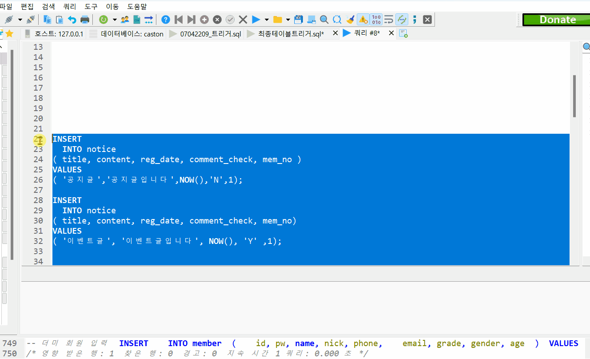
    </p>
    </details>
  
  <li>공지사항 게시글 조회</li>
  <p aling="center">
    
    </p>
  <li>공지사항 게시글 수정</li>
  <p aling="center">
    
    </p>  
  <li>공지사항 게시글 댓글 작성 여부 선택</li>
  <p aling="center">
    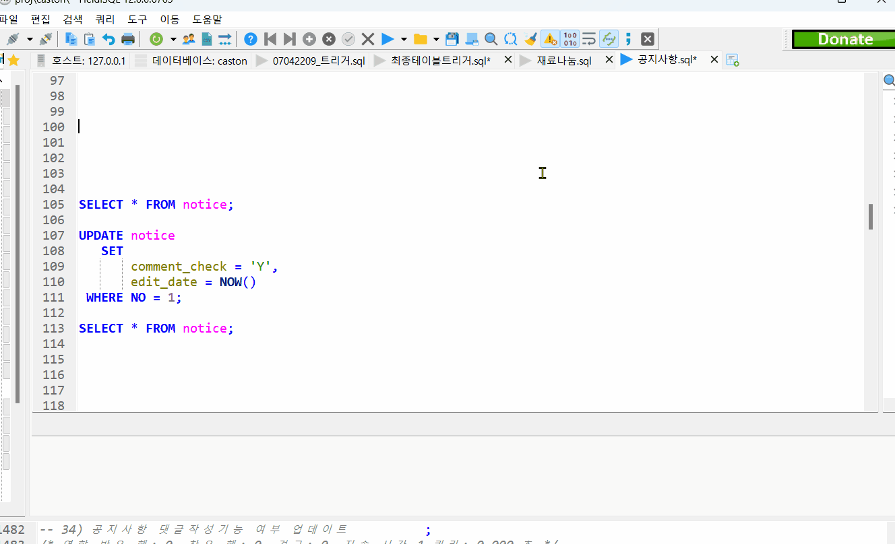
    </p>  
  <li>공지사항 게시글 댓글 작성</li>
  <p aling="center">
    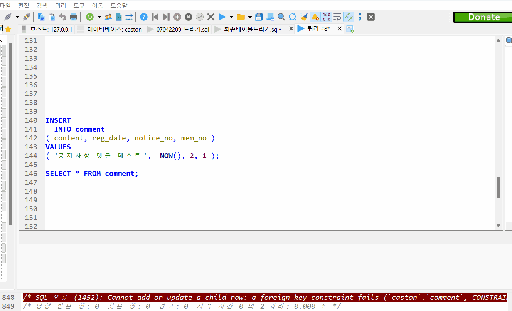
    </p>
  <li>공지사항 게시글 댓글 수정</li>
  <p aling="center">
    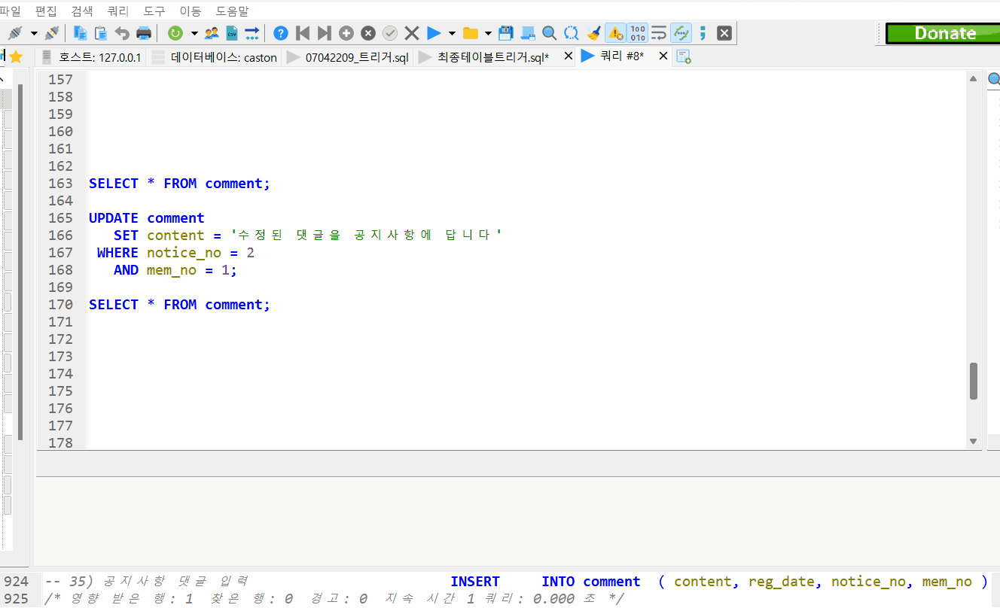
    </p>
  <li>공지사항 게시글 댓글 삭제</li>
  <p aling="center">
    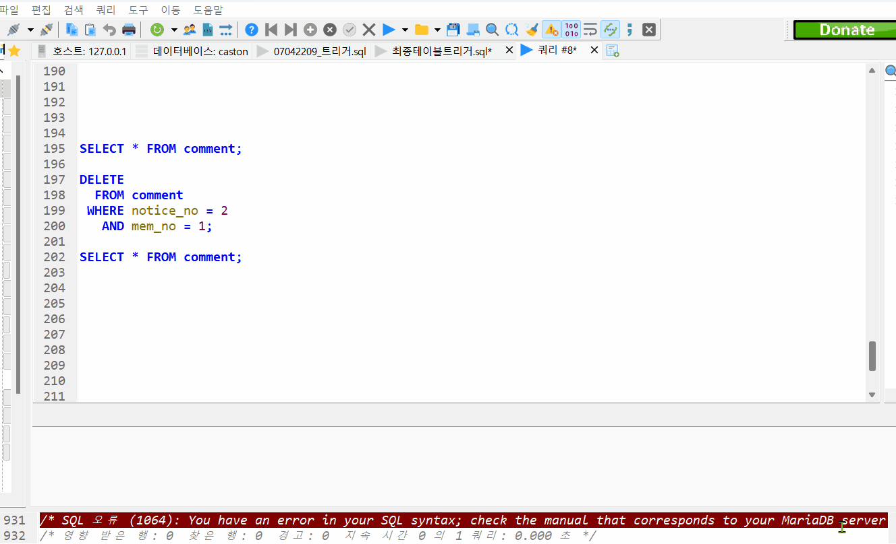
    </p>
  <li>공지사항 게시글 좋아요</li>
  <p aling="center">
    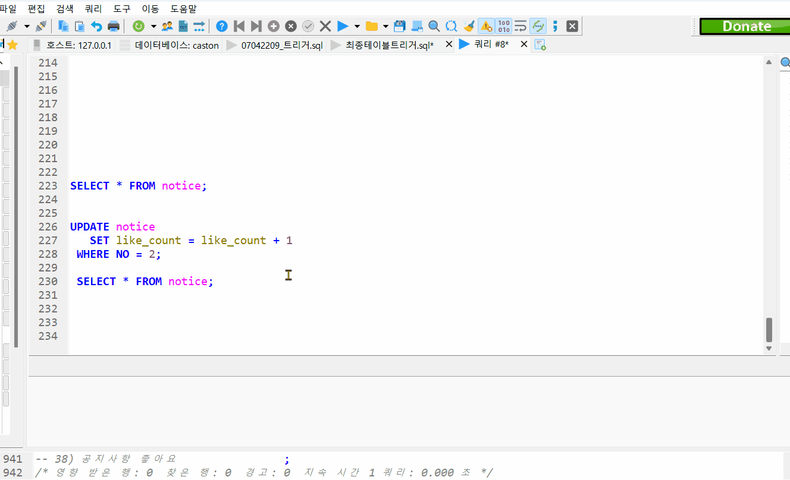
    </p>

</details>  

<details>
<summary>재료나눔 게시판</summary>
  <div markdown = '1'>
<ul>
  <li>재료나눔 게시글 조회</li>
  <p aling="center">
    
    </p>
  <li>재료나눔 게시글 작성</li>
  <p aling="center">
    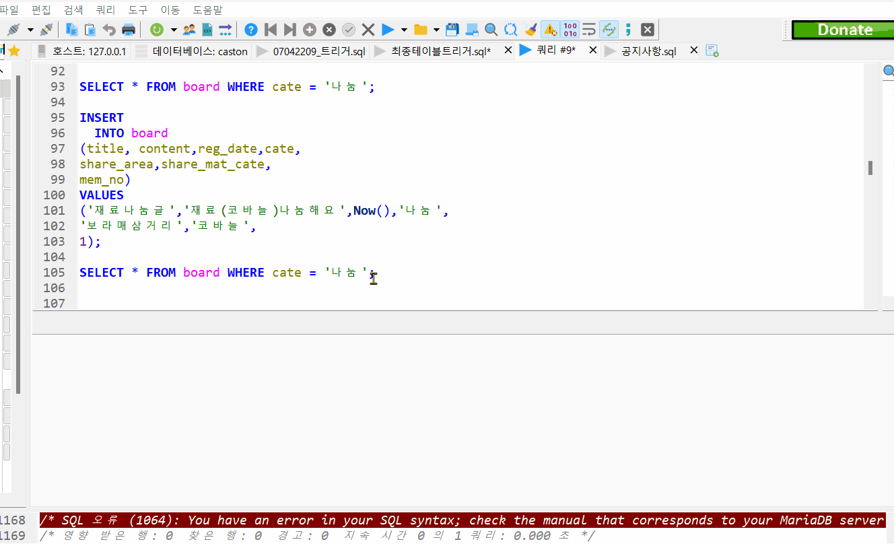
    </p>
  <li>재료나눔 게시글 수정</li>
  <p aling="center">
    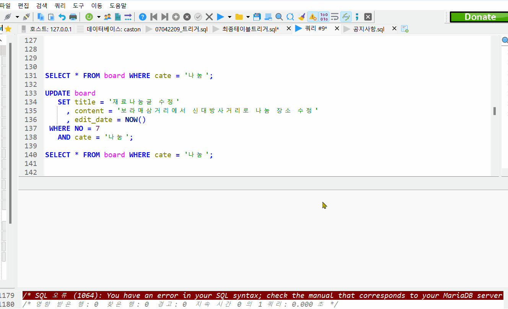
    </p>
  <li>재료나눔 게시글 삭제</li>
  <p aling="center">
    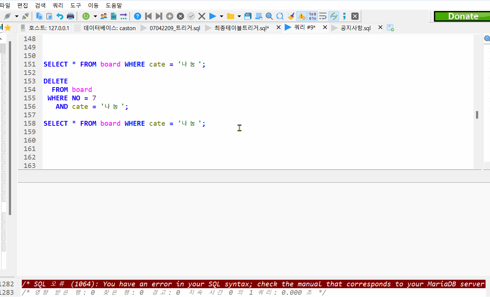
    </p>
  <li>재료나눔 게시글 검색 - 제목</li>
  <p aling="center">
    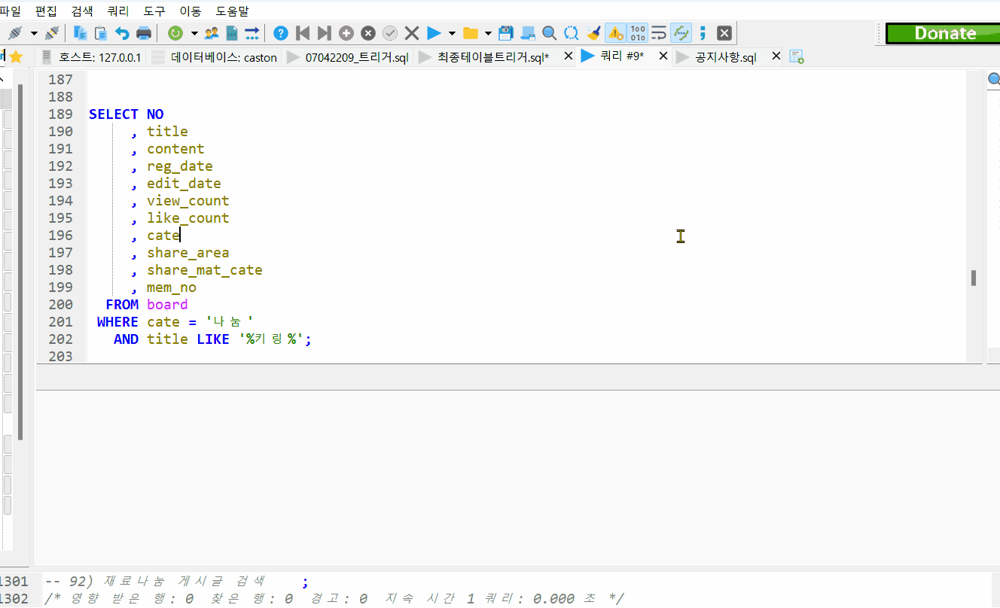
    </p>
  <li>재료나눔 게시글 검색 - 작성자</li>
  <p aling="center">
    
    </p>
  <li>재료나눔 게시글 검색 - 내용</li>
  <p aling="center">
    
    </p>
  <li>재료나눔 게시글 검색 - 재료 카테고리</li>
  <p aling="center">
    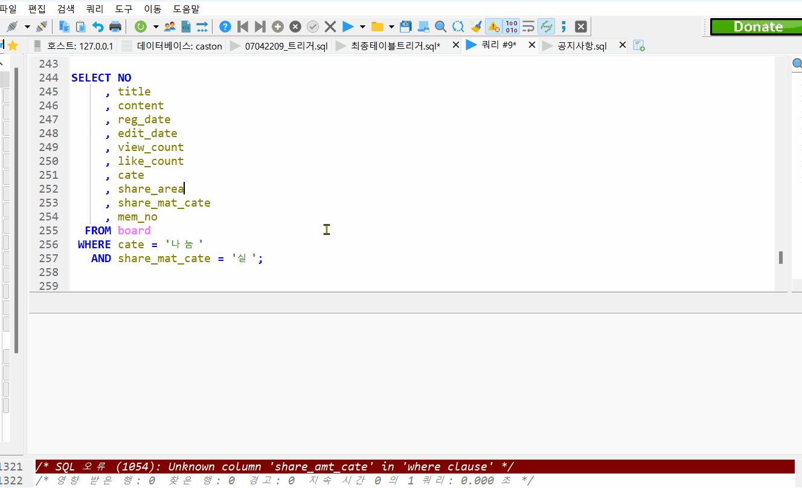
    </p>
</ul>
</div>
</details>  

<details>
<summary>트리거</summary>
  <div markdown = '1'>
<ul>
  <li>트리거 1) 회원 로그인이력 발생 시 통계 집계 </li>
  <p aling="center">
    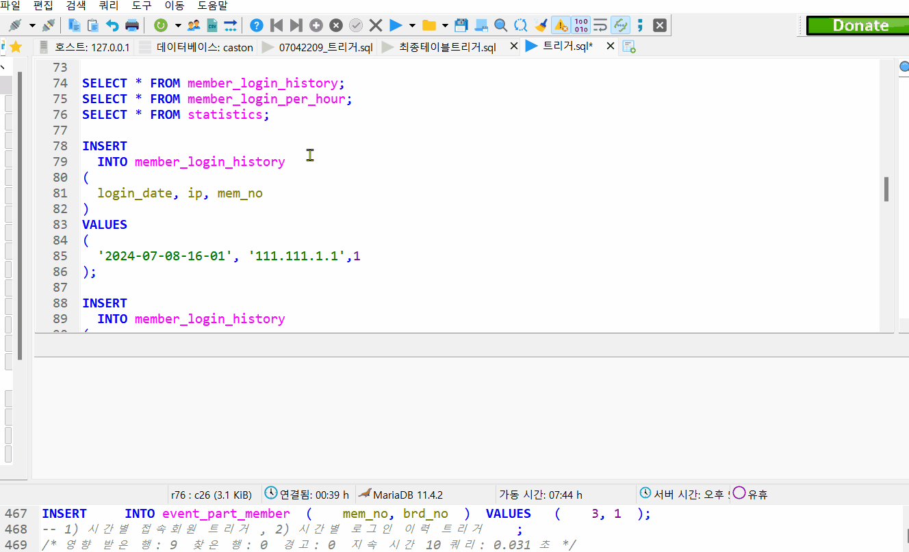
    </p>
  <li>트리거 2) 도안 공유 게시판 게시글 작성 시 통계 집계</li>
  <p aling="center">
    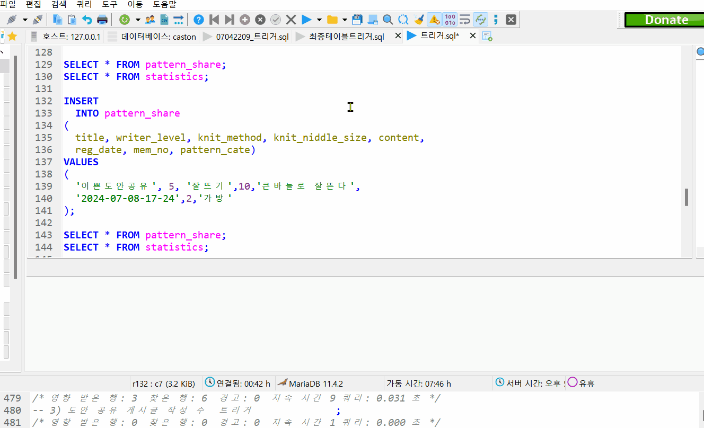
    </p>
  <li>트리거 3) 도안 공유 게시판 게시글 작성 시 통계 집계</li>
  <p aling="center">
    
    </p>
  <li>트리거 4) 재료 나눔 게시글 작성 시 통계 집계</li>
  <p aling="center">
    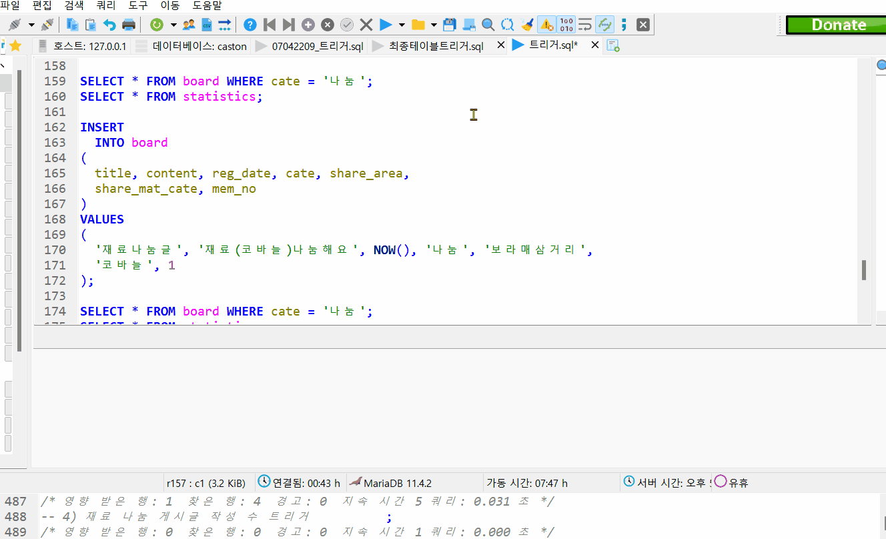
    </p>
  <li>트리거 5) 행사 참여 최대 인원이 넘을 시 알림 발생</li>
  <p aling="center">
    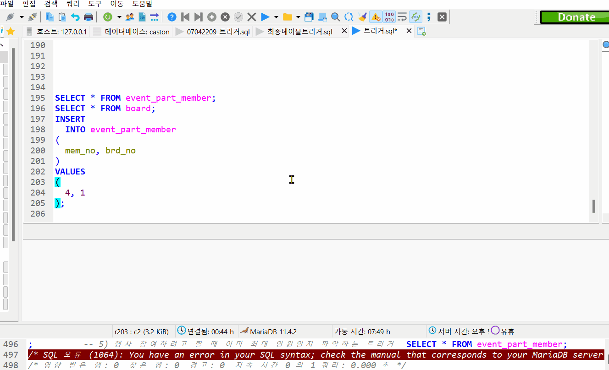
    </p>
</ul>
</div>
</details> 

# :star2: 코드 시연

# :star2: 논의사항 및 규칙
